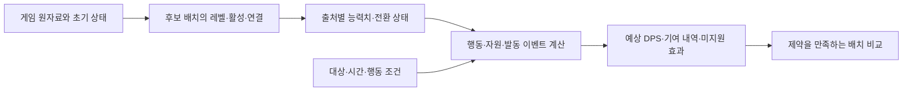

# 자동 배치의 DPS 기준 전환 가능성

2026-09-10, 개발 코드 0.2.8(`3c1846f`)과 설치 게임 1.0.30 기준이다. [대시·위치 효과 검토](DASH-POSITION-FEEDBACK-2026-09-10.md)에 이어 현재 평가·탐색 구조와 게임의 피해·공격·마법·대상 처리 경로를 확인했다. 제품 구현을 변경한 문서가 아니라 교체 가능성과 필요한 작업을 검토한 결과다.

## 결론

**DPS를 자동 배치의 주된 평가 기준으로 바꾸는 것은 가능하다.** 다만 기존 가중치 표를 바꾸는 정도로는 부족하다. 출처별 능력치 계산, 공격과 자원 사용의 시간 모델, 가방 전체를 평가하는 목적함수, 그 목적함수에 맞는 탐색이 필요하다.

권장 목표는 **명시한 대상·시간·행동 조건에서 예상 DPS가 가장 높은 배치**다. 현재 위치에서 앞으로 만날 모든 적과 플레이어의 모든 행동을 정확하게 예측하는 것은 다른 범위다. 시나리오를 명시하면 가정이 어디에 들어가는지 드러내면서 실제 피해식을 기준으로 비교할 수 있다.

석판 질의, 인벤토리 제약, 이동 순서 생성, 자동 적용과 검증 기반은 재사용할 수 있다. 효과 평가와 배치 탐색의 일부는 크게 바뀌며, 추천·설정·재현 자료도 같은 기준으로 연결해야 한다. 검증된 범위를 넓힌 뒤 기본 평가를 교체하는 것이 적절하다.

## 1. 현재 기준이 불명확하게 느껴지는 이유

현재 `PlacementQuality.CompareTo()`는 효과 점수보다 사용 유지·활성 보호·제한 해제 칸 지정·콤보 우선을 먼저 비교한다. 점수 자체도 다음처럼 성격이 다른 값을 공통 레벨 단위로 합친다.

- 일반 능력치: 다른 아티팩트의 레벨당 증가량을 기준으로 환산한다.
- 수치가 없는 효과: 희귀도나 별도 추정값을 사용한다.
- 일부 연결·행 효과: 구조는 게임 규칙을 따르지만 효과량은 추정한다.
- F2 강화·양보: 아이템의 이득에 사용자 배수를 적용한다.

따라서 현재 점수가 높다는 것은 이 정책과 환산 기준에 유리하다는 뜻이다. 실제 피해가 더 높다는 뜻은 아니다. DPS로 교체할 때도 기존 보호·콤보 조건을 그대로 유지하면 정확한 표현은 "지정 조건 안에서 DPS 최대화"다. 모든 조건을 무시하는 순수 DPS 최대화와는 결과가 다르다.

## 2. 게임 코드에서 확인한 구현 근거

DLL SHA-256은 `c3939a7d431f1362daca655938480569e11f501f7d0820a989873765555a7c39`이며 기존 디컴파일 자료와 동일함을 다시 확인했다. 아래는 이 DLL의 구현 근거다. 프리팹 필드의 존재와 생성자 기본값은 구분했고, 기본 숫자를 실제 수집값으로 사용하지 않았다.

| 영역 | 확인한 경로 | 구현상 의미 |
|---|---|---|
| 능력치 | `UnitAvatar.GetCustomStatUnsafe`, `GetRawStatUnsafe`, `GetConvertedElementalDamage` | 기본 기여·계산 보너스·증폭·원소 전환을 게임 순서로 재계산할 수 있다. 아이템별 기여 분리가 먼저 필요하다. |
| 무기 공격 | `WeaponSimple.GetRelatedStatMultiplier`, `CreateDashAttackProjectile`, `NewWeaponFireData` | 원소 능력치, 무기·대시·최종 무기 피해 보너스, 공격 프리팹과 사용 마나가 피해에 연결된다. |
| 무기 공격 빈도 | `WeaponControllerSimple.UpdateAnimatorAttackSpeed`, `UpdateAnimatorSpecialAttackSpeed` | 공격 속도는 애니메이션 속도를 바꾼다. 실제 타격 간격에는 무기 동작·공격 모션·입력 순서가 필요하다. |
| 마법 피해 | `ActiveSkill_Bolt.OnStartMagic`, `OnServerUpdate` | 기본 피해·관련 능력치·마법 피해·소비 마나·발사 수·다중 발사를 구조화할 수 있다. 다른 마법 타입도 각각 확인해야 한다. |
| 마법 자원 | `Charm_Magic.CanCast`, `GetCost`, `FireCasting`, `OnUpdate`, `SkillController` | 마나, 충전 수, 재충전, 시전과 공통 사용 제한을 시간축에서 함께 처리해야 한다. |
| 지원 효과 | `Charm_Basic.RequestCharmDamageBonusOnRoot` | 침 등의 연결 보너스를 영향을 받는 공격의 피해에 반영할 수 있다. 지원 아이템에 별도 추정 점수를 더할 필요가 줄어든다. |
| 영원의 식 | `Charm_FireIceWeapon`, `Charm_IceBow.GetDamage`, `ComboEffect_FlameSword.GetDamage` | 좌우 상태로 실제 피해의 원소 기반을 바꿀 수 있다. 바뀐 피해와 발동 효과를 합쳐 비교한다. |
| 피해 적용 | `DamageInstance.Set`, `UnitAvatar.ApplyDamage` | 출처별 치명타, 대상 방어·원소 방어·회피·보호막, 적 종류, 피해 전후 콜백까지 존재한다. |
| 실제 DPS 표시 | `DamageDummy.ApplyDamage`, `CalculateDps` | 게임은 실제 적용된 피해를 누적해 시간으로 나눈다. 가상 배치의 DPS를 바로 반환하는 예측 API는 아니다. |

### 공통 피해 함수를 그대로 쓰면 되는가

`Charm_Basic.CalculateDamage()`는 네트워크 인스턴스가 없으면 0을 반환한다. 마법인 `Charm_Magic.GetDamage()`는 1을 반환하고, 이 값에 연결 보너스를 곱해 생성된 마법의 `power`로 전달한다. 실제 볼트 피해는 이후 `ActiveSkill_Bolt`에서 계산된다. 따라서 모든 아티팩트에 공통 함수를 호출하고 초당 횟수를 곱하는 방식으로는 실제 DPS를 얻지 못한다.

또한 공격 생성과 피해 적용은 투사체 생성, 자원 소비, 상태 변경과 이벤트 호출을 포함한다. 살아 있는 게임 객체를 후보 배치마다 변경해 시험하는 것은 독립적인 점수 계산이 아니다. 게임에서 필요한 원자료를 읽고, 별도 상태에서 부작용 없이 평가하는 엔진이 적합하다.

## 3. 현재 입력에서 부족한 것

활성 카탈로그 형식 15, 세대 `20260909T163029007-f907b716718b48b4989469c5d99ee0de`를 집계했다. 아티팩트 299종, 동작 타입 136개, 공격 가능 표시가 있는 정의 70개, 마법 정의 26개다. 이는 정의 분류 수이며 공격 효과의 지원율이나 구현 작업 수가 아니다. 공격 가능 표시가 없어도 능력치·발동 효과로 DPS에 기여할 수 있다.

마법 26종의 기본 마나 비용은 수집돼 있지만, `CharmDefinition`에는 DPS 계산에 필요한 마법 피해 배열·충전 수·기본 재충전 시간·시전 동작·투사체 타격 조건이 없다. 무기 입력도 현재는 종류 이름으로, 실제 무기 엔티티·강화·동작·공격 프리팹 구성을 표현하지 않는다.

F10 효과 진단은 직접 기여의 합, 계산 보너스, 증폭과 최종 능력치를 기록한다. 그러나 각 아이템·무기·콤보·외부 버프가 준 양을 모두 분리한 자료는 아니다. 합계만 고정하면 아티팩트 제거·강화·원소 전환 뒤의 값을 올바르게 예측할 수 없다.

추가 입력은 다음처럼 나누는 것이 적절하다.

| 자동 수집할 게임 데이터 | 시나리오에서 정할 조건 |
|---|---|
| 무기·아티팩트·마법·콤보·상태 효과의 프리팹 수치와 동작 타입 | 단일 대상 또는 다수 대상, 대상 방어·종류와 적중 가정 |
| 기본 능력치와 출처별 기여·증폭·전환·연결 | 평가 시간, 초기 마나·충전·버프 상태 |
| 실제 공격 동작, 타격 수, 비용·재충전·발동 규칙 | 일반·대시·특수 공격 사용 정책, 마법 사용 우선순위 |
| 관측 가능한 공격·적중·자원·효과 이벤트 | 공격을 계속할 수 있는 비율, 회피·피격 조건 |

자동으로 읽을 수 있는 게임 수치를 사용자에게 입력하게 할 필요는 없다. 사용자 선택이나 관측이 필요한 것은 어떤 전투와 행동을 기준으로 비교할지다. 관측한 공격 횟수를 그대로 고정하면 공격 속도·자원 변경의 이득을 놓치므로, 관측값을 활용하더라도 행동 정책 아래에서 가능한 횟수를 다시 계산해야 한다.

## 4. 목적함수와 평가 구조

평가할 배치를 L, 초기 상태를 S, 행동·대상 조건을 P, 시간을 T라고 하면 목표는 다음과 같다.

```text
예상 DPS(L | S, P, T) = T 동안 대상에게 적용되는 총피해의 기댓값 / T
```

피해량에 아이템 중요도 10배를 곱하면 물리적인 DPS 단위가 깨진다. DPS 모드에서는 실제 피해를 그대로 보여 주고, 사용할 공격·유지할 아이템·허용할 비활성화를 별도 조건으로 표현하는 편이 일관된다. 기존 F2 설정의 의미는 자동으로 바꾸지 말고 모드별 적용 범위를 명시해야 한다.



일반 피해·독립적인 치명타처럼 가능한 부분은 기대값 수식으로 빠르게 계산할 수 있다. 마나 경쟁, 중첩, 쿨다운 초기화, 적중 후 재발동처럼 서로 영향을 주는 부분은 사건 발생 시각을 따라가는 모델이 필요하다. 상태를 바꾸는 확률 이벤트까지 단순 평균으로 대체하면 틀릴 수 있다. 그런 효과는 분기 계산이나 재현 가능한 확률 시뮬레이션을 검토하고 비교 오차도 측정해야 한다.

"마법 피해 ÷ 쿨다운"을 모두 더하면 같은 마나와 시전 시간을 여러 마법에 중복 배정할 수 있다. 비용 감소도 항상 같은 이득이 아니다. 게임 볼트 경로에는 소비한 마나가 피해를 높이는 효과가 있어, 비용 절감에 따른 추가 시전과 한 발 피해 변화가 함께 계산돼야 한다.

순간 화력과 지속 화력은 별도 결과가 될 수 있다. 평가 시간과 초기 충전 상태는 모든 후보에 같은 정책으로 적용해야 한다. 총 DPS와 함께 무기·대시·마법·소환·지속 피해의 기여, 자원 부족으로 못 쓴 공격, 미지원 효과를 표시하면 배치 이유를 설명할 수 있다.

## 5. 탐색도 바꿔야 하는 이유

현재 `PlacementSolver.Assign()`은 아이템×칸 비용표를 만들고 헝가리안 배정을 사용한다. `ScoreOf()`도 아이템별 `Value()`를 합친다. `BuildEstimateModel()`의 레벨별 가치로 석판 후보를 줄인다. DPS는 다른 아이템이 올린 능력치와 공격 빈도에 따라 한 아이템의 이득이 달라지므로 고정 비용의 합으로 정확하게 분해되지 않는다.

DLL의 대시 피해 배율 경로를 다른 보너스가 없는 조건으로 제한하고, 실제 아이템 수치가 아닌 합성 입력으로 이를 확인했다.

| 합성 구성 | 물리 피해 능력치 +20의 한 타격 이득 | 대시 공격 피해 보너스 +20의 한 타격 이득 | 우선순위 |
|---|---:|---:|---|
| 물리 20, 대시 보너스 100 | 40 | 4 | 물리 |
| 물리 200, 대시 보너스 0 | 20 | 40 | 대시 |

물리 100·대시 보너스 0에서 두 증가분을 각각 계산하면 이득 합은 40이지만, 함께 적용하면 44다. 영원의 식도 제한된 두 공격의 원소 기반 계산에서 화염 100·얼음 20이면 왼쪽, 값을 뒤집으면 오른쪽이 유리했다. 모든 숫자는 반례용 입력이며 실제 DPS·실제 아이템 조합의 성능 측정값이 아니다.

가능한 탐색 구조는 다음과 같다.

1. 석판 질의·조건 계산을 재사용해 실행 가능한 배치를 만든다.
2. 현재 빌드에서 능력치·레벨 변경의 한계 이득을 계산해 빠른 후보 생성에 쓴다. 기존 배정기는 이 근사 단계에서 활용할 수 있다.
3. 후보 전체를 새 DPS 평가기로 다시 계산하고, 아이템 묶음 이동·교환·석판 회전을 탐색한다. 전환·발동 해금·콤보 임계값을 넘는 후보도 포함한다.
4. 후보 가지치기도 새 목적에 맞춘다. 기존 점수로 추린 몇 개만 DPS로 재정렬하면 좋은 후보가 앞에서 탈락할 수 있다.
5. 대상·행동 조건·초기 상태·평가 버전을 캐시와 계획 지문에 포함하고, 변경된 기여만 다시 계산한다. 형상만 같은 후보의 캐시와 평가 결과 캐시를 구분한다.

대규모 가방의 전역 최적성은 보장하지 않는다. 작은 가방 전체 열거와 비교해 탐색 손실을 측정하고, 실제 가방에서 실행 시간과 할당량을 측정해야 한다. 새 DPS 엔진이 아직 없으므로 현재 성능 숫자나 완료 일정을 제시할 근거는 없다.

## 6. 지원하지 않는 효과와 생존의 처리

미지원 효과를 0 DPS로 처리하거나 희귀도 점수를 DPS에 섞으면 현재 문제를 이름만 바꿔 되풀이한다. 현재와 후보에 같은 미지원 아이템이 있다는 이유만으로 오차가 상쇄되는 것도 아니다. 그 아이템이 사용하는 원소·공격 속도·마나·연결이 바뀌면 효과량도 달라질 수 있다.

초기 도입은 지원한 공격과 그 공격에 영향을 주는 효과를 검증한 범위로 제한한다. 비교에 영향을 주는 미지원 효과가 있으면 불완전한 비교임을 알리고, 검증되지 않은 전체 DPS 향상이나 자동 적용의 근거로 사용하지 않는다. 전체 교체의 완료 기준은 관련 효과의 수집·평가·실기 일치다.

순수 DPS 목적에는 직접 화력에 기여하지 않는 체력·방어·회피·이동 효과의 가치가 없다. 다만 방어력을 공격으로 바꾸는 등 실제 피해 경로가 있으면 해당 기여는 계산해야 한다. 생존 능력치를 임의의 DPS 점수로 환산하기보다는 사용 유지, 최소 능력치, 비활성 허용 같은 제약으로 분리하는 것을 권장한다. 현재의 활성 보존만으로 방어 아이템의 레벨 하락까지 막는 것은 아니다.

## 7. 권장 도입 순서

| 단계 | 산출물 | 통과 기준 |
|---|---|---|
| 1. 효과와 능력치 기반 | 원자료 확장, 출처별 능력치와 위치 전환, 지원 범위 진단 | 현재·이동·레벨 변경·제거 후 게임 상태와 일치 |
| 2. 제한된 전투 평가 | 단일 대상, 정한 행동 정책의 무기·대시 및 검증한 마법 피해와 자원 계산 | 같은 입력에서 한 타격·자원 소비·발동 횟수·구간 총피해 일치 |
| 3. 배치 탐색 연결 | 전체 배치 DPS 평가, 후보 생성·최종 비교·추천의 공통 목적함수 | 작은 가방 전체 열거, 대시·영원의 식·마나 병목 등의 배치 방향 검증 |
| 4. 관측과 확장 | 미지원 공격·소환·지속 피해·발동 상호작용 추가, 실전 자료 대조 | 지원 효과의 의존 관계까지 확인하고 오차와 계산 비용 측정 |
| 5. 기본 기준 교체 | DPS 모드의 설명·설정·재현·계획 무효화·자동 적용 통합 | 기존 제약의 의미 보존, 지원 범위 명시, 실제 사용 사례 대조 |

처음부터 범용 전투를 모두 시뮬레이션하기보다, 자동 배치에 필요한 범위에서 피해식·자원·행동을 구현하고 검증한다. 대시 옵션과 영원의 식은 이 과정에서 별도 가중치 예외 없이 실제 영향을 받는 피해 경로로 연결할 수 있다.

구현 전에 정할 제품 정책은 기준 대상·시간창·행동 정책, 생존 조건, 기존 중요도·콤보 우선과의 관계다. 이번 검토에서는 이 선택을 사용자 대신 확정하지 않았다.

## 8. 검증의 범위와 주의점

이번에는 게임 코드와 현재 구조를 검토하고 `artifacts/dps-feasibility/probe.ps1`로 제한된 피해식의 비가산성·구성별 우선순위 역전·원소 방향 선택을 재현했다. 종료 코드 0이며 결과는 같은 폴더의 `results.txt`에 있다. 새 DPS 엔진이나 자동 배치 성능을 검증한 것은 아니다.

앞선 분석에서 실행한 `scripts/check.ps1`은 테스트 559개와 포맷·DataTool·Plugin 빌드를 통과했다. 이번에는 제품 코드를 변경하지 않아 동일 검사를 반복하지 않았다. 게임 내 공격·설치·자동 배치를 실행하지 않았으며 실전 피해량은 미측정이다.

실기 검증은 허수아비 표시 숫자 하나만 비교하면 충분하지 않다. `DamageDummy`는 실제 적용 피해를 집계하지만 측정 시작·종료와 초기 상태를 맞춰야 한다. 굴렁쇠용 채의 `ResetBonus()`는 허수아비 적중을 초기화 대상에서 제외하므로 일반 적과 행동이 달라진다. 허수아비와 일반 적의 규칙 차이를 구분해 타격·자원·효과 이벤트를 함께 대조해야 한다.

종이와 일부 능력치 전환은 실제 교환·갱신 순서에도 영향을 받는다. [효과 예측 가능성 검증](EFFECT-PREDICTION-FEASIBILITY.md)의 상태 재현 모델은 진단 실험이며 제품 평가에 통합되지 않았다. 이를 DPS 기준으로 바꾸더라도 최종 좌표만으로 모든 초기 상태를 확정할 수 있다고 가정해서는 안 된다.

주요 코드: [평가·배정](../src/SephPlanner.Core/Solver/PlacementSolver.cs), [비교 순서](../src/SephPlanner.Core/Solver/PlacementQuality.cs), [카탈로그 수집](../src/SephPlanner.Plugin/ItemCatalog.cs), [효과 정의](../src/SephPlanner.Core/Model/CharmDefinition.cs), [계획 입력](../src/SephPlanner.Core/Runtime/GameSnapshot.cs), [효과 진단](../src/SephPlanner.Plugin/EffectStateDiagnostics.cs), [후보 캐시](../src/SephPlanner.Core/Solver/LayoutCache.cs).
